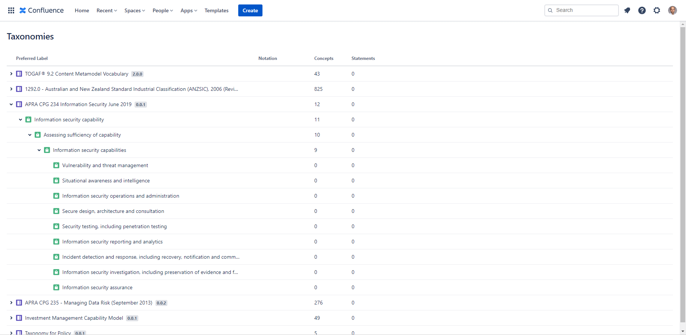
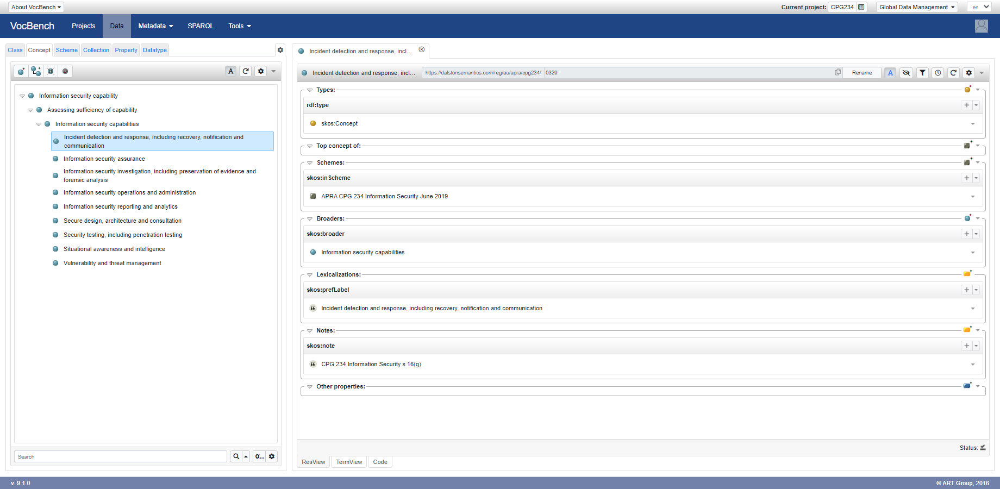

# CPG 234 Taxonomy - Information Security Capabilities

This taxonomy of information security capabilities is derived from [CPG 234 Information Security](https://www.apra.gov.au/information-security). This initial version can be extended to cover the entirety of CPG 234.

Use it with [Taxonomies for Confluence](https://dalstonsemantics.com/services/taxonomies-for-confluence/) to index [Confluence](https://www.atlassian.com/software/confluence) pages and track alignment with CPG 234.

Developed with [Simple Knowledge Organization System (SKOS)](https://www.w3.org/2004/02/skos/) this taxonomy can also be imported and published with [controlled vocabulary tools](https://github.com/gbv/bartoc.org/wiki/Software-for-controlled-vocabularies).

## Attribution and Disclaimer

This work, "CPG 234 Taxonomy", is a derivative of [Prudential Practice Guide CPG 234 Information Security June 2019](https://www.apra.gov.au/information-security) by [Australian Prudential Regulation Authority (APRA)](https://www.apra.gov.au/) used under [Creative Commons Attribution 3.0 Australia Licence (CCBY 3.0)](www.creativecommons.org/licenses/by/3.0/au/)

While APRA endeavours to ensure the quality of this publication, it does not accept any 
responsibility for the accuracy, completeness or currency of the material included in this 
publication and will not be liable for any loss or damage arising out of any use of, or 
reliance on, this publication.

APRA do not endorse this derivative work or its author.